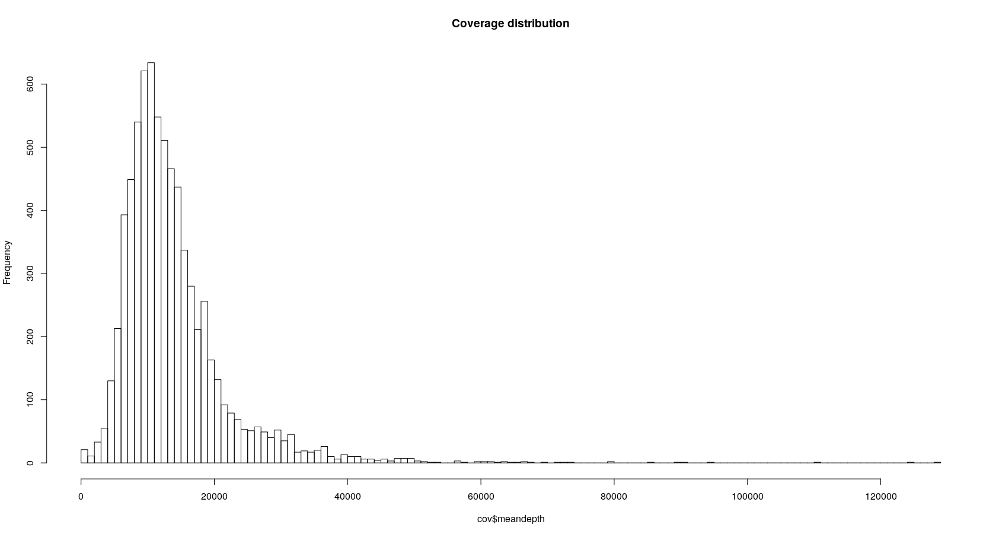

### Methods ###

Genetic material was taken from 194 patients with ASD. During preparation of paired-end libraries 3 different capture assays were used: TruSeq DNA Exome for 73 samples (hg19 build); SureSelect Human All Exon V7 for 120 samples (hg38 build); SureSelect Human All Exon V6+UTR r2 for 1 samples (hg38 build). DNA sequencing was performed on Illumina HiSeq 4000 generating 35-100 nucleotide reads.

Paired-end reads were aligned using bwa (0.7.17-r1188) to hg19 human reference genome for 73 subjects and hg38 for 121 subjects. Raw aligned BAM files were then subjected to sorting, duplicate reads marking and base quality score recalibration as per GATK Best Practices for data preprocessing. Base recalibrated BAM files were then used in Germline short variant discovery workflow. Both preprocessing and variant calling steps were done using GATK version 4.1.6.

Since 3 different capture assays were used for library preparation, 3 groups of samples were subjected to joint-genotyping separately. Resulting hg38 VCF call-sets were lifted-over to hg19 build using Assembly Converter, and all 3 VCF call-sets were then merged with bcftools (1.10.2). The whole call-set was annotated with Annovar.

 
